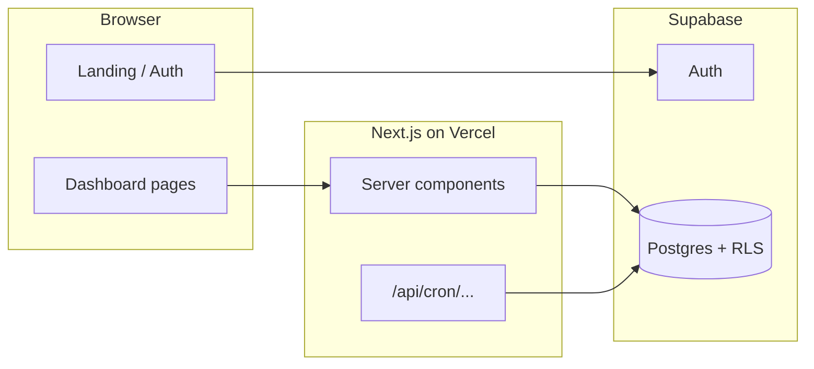

# TransferPath

**TransferPath** is a free, open-source web app that helps **Texas community college students** plan a transfer to a four-year university. Students set a target school and major, map courses semester-by-semester, track requirements, and work through an application checklist—with deadlines pulled from a shared database.

> **Planner only, not admissions advice.** Deadlines and requirements are for organization. Always confirm dates and rules on each school’s official site.

---

## What we built

### For students (product)

| Area | What it does |
|------|----------------|
| **Landing** | Marketing home: how it works, schools, sign-up CTA |
| **Onboarding** | 5-step wizard: current school, target school, major, field of study, transfer term |
| **Overview** | Readiness score, next critical action, roadmap (same phases as Timeline), deadlines, gaps |
| **Semester Timeline** | Journey map: Foundation & core → Major prerequisites → Essay → Application → Target enrollment; add/edit courses |
| **Requirements** | Read-only status for prereqs, GPA/credits, essays, transcripts, rec letters, ApplyTexas |
| **Checklist** | Actionable tasks (toggle complete); academic items auto-sync from courses on Timeline |
| **Essay workspace** | Draft transfer essay with save to Supabase |
| **Settings** | Profile, schools, GPA/credits, notifications, compact dashboard, help guides |

### Under the hood

- **Next.js 16** (App Router) + **React 19** + **TypeScript**
- **Supabase**: Postgres, Auth (email/OAuth), Row Level Security
- **Tailwind CSS 4** + shadcn-style UI — “Academic Futurism” (cream, navy, burnt orange, Playfair + Inter)
- **Resend** (optional): weekly deadline reminder emails via secured cron route



---

## Repository layout

```
src/
  app/                    # Routes (landing, auth, dashboard/*, api/cron)
  components/             # UI, landing, dashboard workspaces
  lib/                    # Business logic (readiness, timeline, requirements, checklist)
  types/                  # Shared TypeScript types
supabase/
  migrations/             # SQL schema, seeds, RLS, deadline data
scripts/                  # publish-to-github.sh, deploy-vercel.md
```

Key logic files:

- `lib/build-timeline-milestones.ts` — Timeline phases (shared with Overview roadmap)
- `lib/build-overview-data.ts` — Overview dashboard data
- `lib/dashboard-overall-readiness.ts` — Weighted readiness score
- `lib/requirements-checklist-sync.ts` — Checklist ↔ Requirements status
- `lib/checklist-derived-status.ts` — Auto-complete checklist from courses/GPA/essay

---

## Quick start (local)

### Prerequisites

- Node.js 20+
- A [Supabase](https://supabase.com) project (free tier is fine)

### 1. Clone and install

```bash
git clone https://github.com/YOUR_USERNAME/transferpath.git
cd transferpath
npm install
```

### 2. Environment

```bash
cp .env.example .env.local
```

Fill in at minimum:

- `NEXT_PUBLIC_SUPABASE_URL`
- `NEXT_PUBLIC_SUPABASE_ANON_KEY`

### 3. Database

Link your Supabase project and apply migrations:

```bash
npx supabase login
npx supabase link --project-ref YOUR_PROJECT_REF
npx supabase db push
```

Optional seed data is in `supabase/seed.sql` if you use local seeding.

### 4. Auth redirects (local)

Supabase → **Authentication** → **URL configuration**:

- Site URL: `http://localhost:3000`
- Redirect URLs: `http://localhost:3000/auth/callback`

### 5. Run

```bash
npm run dev
```

Open [http://localhost:3000](http://localhost:3000).

---

## Environment variables

| Variable | Required | Purpose |
|----------|----------|---------|
| `NEXT_PUBLIC_SUPABASE_URL` | Yes | Supabase project URL |
| `NEXT_PUBLIC_SUPABASE_ANON_KEY` | Yes | Public anon key (RLS) |
| `NEXT_PUBLIC_SITE_URL` | Prod | Canonical URL for emails/links |
| `NEXT_PUBLIC_SUPPORT_EMAIL` | No | Mailto in Settings → Help |
| `SUPABASE_SERVICE_ROLE_KEY` | Cron only | Server cron; bypasses RLS |
| `CRON_SECRET` | Cron only | Protects `/api/cron/deadline-reminders` |
| `RESEND_API_KEY` / `RESEND_FROM_EMAIL` | Cron only | Send reminder emails |

**Never** put service role or Resend keys in `NEXT_PUBLIC_*` variables.

---

## Publish to GitHub (new public repo)

From the project root, after [installing GitHub CLI](https://cli.github.com/) and logging in:

```bash
gh auth login
chmod +x scripts/publish-to-github.sh
./scripts/publish-to-github.sh transferpath
```

That creates a **public** repo named `transferpath` and pushes `main`. Use a different name: `./scripts/publish-to-github.sh my-repo-name`.

---

## Deploy live (free)

**Recommended:** [Vercel](https://vercel.com) (Hobby/free) + your existing **Supabase** project.

Step-by-step: **[scripts/deploy-vercel.md](./scripts/deploy-vercel.md)**

Summary:

1. Push this repo to GitHub (above).
2. Vercel → **Import** the repo → add `NEXT_PUBLIC_SUPABASE_*` env vars → Deploy.
3. Set Supabase **Site URL** and **Redirect URLs** to your `*.vercel.app` domain.
4. Set `NEXT_PUBLIC_SITE_URL` to that URL and redeploy.

No credit card required for typical student-project traffic on Vercel Hobby + Supabase Free.

---

## Weekly deadline emails (optional)

Route: `GET|POST /api/cron/deadline-reminders`  
Header: `Authorization: Bearer <CRON_SECRET>`

Uses `deadline_reminder_recipients()` and Resend. See migration `20260521200000_deadline_reminder_recipients_fn.sql`. Schedule weekly on Vercel Cron or GitHub Actions.

---

## Scripts

| Command | Description |
|---------|-------------|
| `npm run dev` | Local dev server |
| `npm run build` | Production build |
| `npm run start` | Run production build locally |
| `npm run lint` | ESLint |

---

## License

MIT — see [LICENSE](./LICENSE).

---

## Contributing

Issues and PRs welcome. Please do not commit secrets or `.env.local`.
